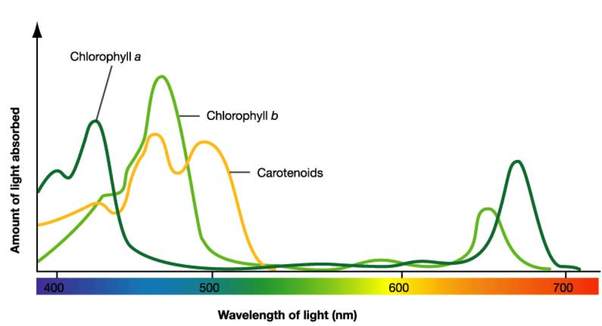

## Ilumination

The production of energy of a plant occurs following the formula

6CO2 + 6H2O + light -> C6H12O6 + 6O2

The best spectrum for the plant grows is represented in the image below

You have to also consider the distance that the light source is of the plant
 you want to grow.
 Since ilumination intensity has a exponencial behavior with distance.
 
 

